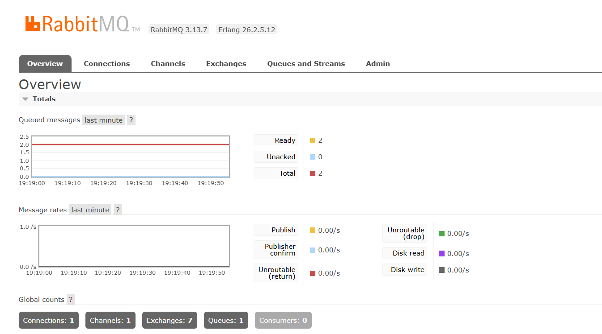
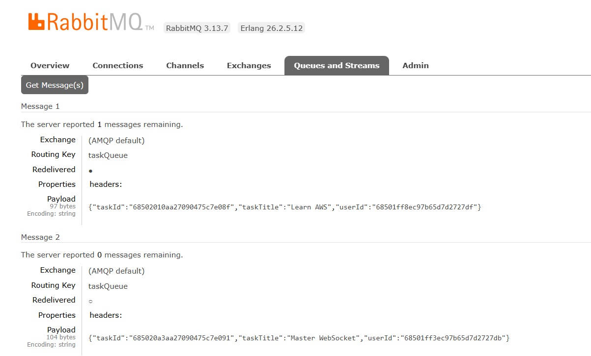
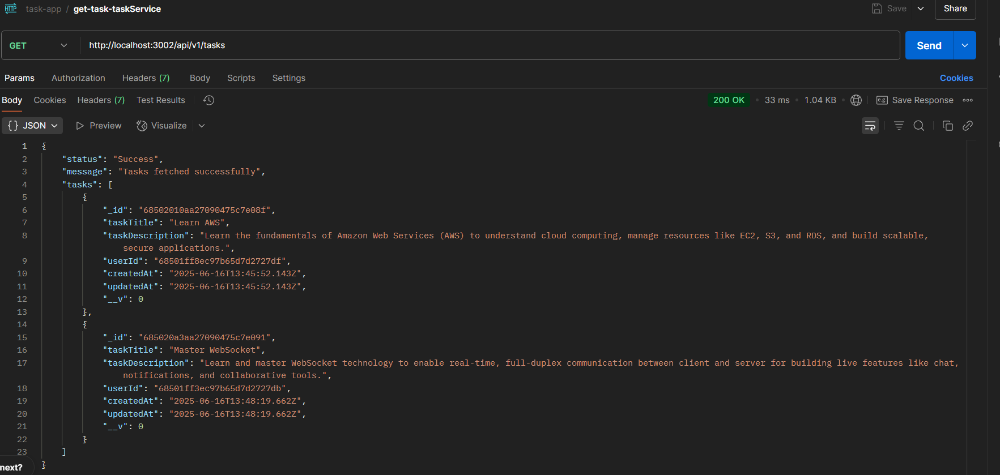

# Task Management Microservices Application with RabbitMQ For Learning

A microservices-based task management system built with Node.js, Express, MongoDB, RabbitMQ and Docker.


*RabbitMQ logs displaying successful queuing of 2 task messages*


*Detailed view of message content in RabbitMQ queue*


*API response showing tasks list in Postman interface*

## Architecture Overview

The application consists of three main microservices:
- **User Service** (Port 3001): Handles user management operations
- **Task Service** (Port 3002): Manages task-related operations
- **RabbitMQ Service** (Port 5672): Handles message queuing for tasks

Each service has its own Dockerfile for containerization.

## Services Description

### User Service
- User creation 
- Get all users
- Runs on port 3001
- Independent database for user data
- Custom Dockerfile for service configuration

### Task Service
- Task creation with message queue integration
- Get all tasks 
- Runs on port 3002
- Separate database for task data
- Custom Dockerfile for service configuration
- Publishes messages to RabbitMQ when tasks are created

### RabbitMQ Service
- Message queue for task events
- Runs on default port 5672
- Tracks task creation events
- Provides message persistence
- Integrated with Task Service

## Technical Stack

- Node.js
- Express
- MongoDB
- RabbitMQ
- Docker
- Docker Compose
- Postman (for API testing)

## Running the Application

1. Build the services:
```bash
docker-compose build
```

2. Start all services:
```bash
docker-compose up
```

3. Access the services:
- User Service: `http://localhost:3001`
- Task Service: `http://localhost:3002`
- RabbitMQ Management: `http://localhost:15672`

## Message Queue Implementation

The system utilizes RabbitMQ for task event handling:
- Each new task creation triggers a message to the taskQueue
- RabbitMQ logs show successful message routing (as evidenced in the logs image showing 2 messages)
- Messages contain task details (shown in the message details image)
- Task creation can be verified through the Postman API interface

## Docker Configuration
The `docker-compose.yml` file orchestrates:
- User Service container
- Task Service container
- RabbitMQ container
- Database containers
- Network configuration
- Port mappings

## API Documentation and Testing

All API endpoints have been tested using Postman to ensure functionality.

### User Service Endpoints (Tested)
- POST `/api/v1/users` - Create new user
- GET `/api/v1/users/` - Get all users

### Task Service Endpoints (Tested)
- POST `/api/v1/tasks` - Create new task (triggers RabbitMQ message)
- GET `/api/v1/tasks` - List all tasks

## Development and Deployment

1. Clone the repository
2. Install Docker and Docker Compose
3. Run `docker-compose up` to start all services
4. Access and test endpoints through Postman or your preferred API client

## License

This project is licensed under the MIT License.